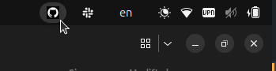

# GitHub Notifications in System Tray

A lightweight system tray notifier for GitHub notifications using yad. It checks for unread notifications and displays an icon in the system tray when new notifications are available. Clicking the icon opens GitHub notifications in the browser.



Features:

- Shows a tray icon when there are new GitHub notifications.

- Hides the icon when no notifications exist.

- Refreshes every 60 seconds.

- Opens GitHub notifications when clicked.

## Installation

1. Install Dependencies

Make sure you have the necessary packages installed:

```
sudo apt update
sudo apt install -y yad jq xdg-utils gh
```

2. Log in with GitHub

```
gh auth login
```

3. Clone the Repository

```
git clone https://github.com/YOUR_GITHUB_USERNAME/github-tray-notifier.git
cd github-tray-notifier
```

4. Make the Script Executable

```
chmod +x github-tray.sh
```

5. Test the script

```
./github-tray.sh
```

6. Auto-Start on Login

To start the notifier automatically on login:

Open a terminal and run:

```
mkdir -p ~/.config/autostart
nano ~/.config/autostart/github-tray.desktop
```

Paste the following content:

```
[Desktop Entry]
Type=Application
Exec=/path/to/github-tray.sh
Hidden=false
NoDisplay=false
X-GNOME-Autostart-enabled=true
Name=GitHub Notifications
```

Save the file (CTRL+X, then Y, then Enter).

Replace `/path/to/github-tray.sh` with the actual path.

Now, the script will automatically start on login.

7. Stopping the Script

To stop the script from running:

```
pkill -f github-tray.sh
```

To disable auto-start, delete the autostart file:

```
rm ~/.config/autostart/github-tray.desktop
```
